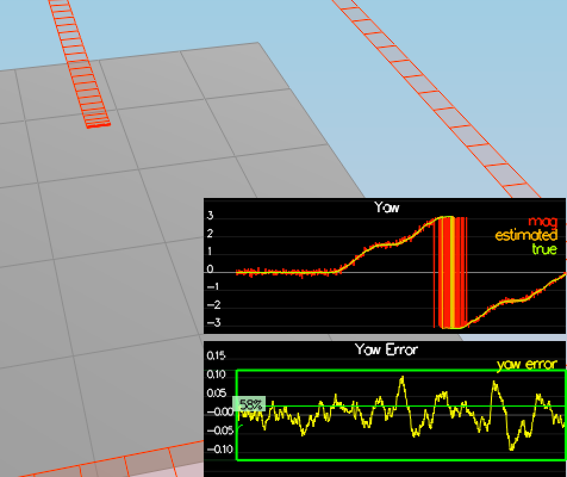
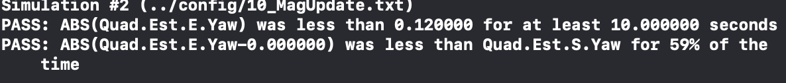
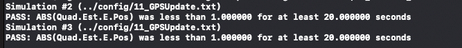

## Step 1: Sensor Noise ##

After running the simulator with scenario `06_NoisySensors` sensor data recorded to the following csv files with headers: `config/log/Graph1.txt` (GPS X data) and `config/log/Graph2.txt` (Accelerometer X data).
Since quad was static, we can use this data to figure out the standard deviation of the the GPS X signal and the IMU Accelerometer X signal.

After putting the data to Excel we can calculate standard deviation for X position and acceleration.
The calculated values were 0.72 for poisiton and 0.51 for acceleration.

The result was plugged into the top of `config/6_Sensornoise.txt`, the values for `MeasuredStdDev_GPSPosXY` and `MeasuredStdDev_AccelXY` were set in the following way:

```
MeasuredStdDev_GPSPosXY = .72
MeasuredStdDev_AccelXY = .51
```

### Evaluation 
We see that all tests are passed:
<p align="center">

</p>


## Step 2: Attitude Estimation ##

We need to improve the complementary filter-type attitude filter with a better rate gyro attitude integration scheme.

Run scenario `07_AttitudeEstimation`.  For this simulation, the only sensor used is the IMU and noise levels are set to 0 (see `config/07_AttitudeEstimation.txt` for all the settings for this simulation). 

We've implemented a better rate gyro attitude integration scheme using nonlinear complementary filter instead of linear one in the `UpdateFromIMU()` in the `QuadEstimatorEKF.cpp`.  
We used 7.1.2 part of the [Estimation for Quadrotors](https://www.overleaf.com/read/vymfngphcccj) for math reference.

Here is the code:

```
  // see 7.1.2 in https://www.overleaf.com/project/5c34caab7ecefc04087273b9
  Quaternion<float> qtStateQuaternion = EstimatedAttitude();
  Quaternion<float> qIntegratedBodyRates = qtStateQuaternion.IntegrateBodyRate(V3D(gyro.x, gyro.y, gyro.z), dtIMU);
  float predictedPitch = qIntegratedBodyRates.Pitch();
  float predictedRoll = qIntegratedBodyRates.Roll();
  ekfState(6) = qIntegratedBodyRates.Yaw(); // yaw
```
### Evaluation
We see on Y axis that the errors in estimation are much smaller now than in the liner scheme:


 
We also see that all tests are passed:


## Step 3: Prediction Step ##

### 3.1 Update the state vector

After running scenario `08_PredictState` we see that the estimated state doesn't follow the true state.

In order to update state vector we need to implement the prediction step in `QuadEstimatorEKF.cpp` in the `PredictState()` functon:

```
V3F accelerationInertialFrame = attitude.Rotate_BtoI(V3F(accel.x, accel.y, accel.z));

// position update  - getting from current velocity
predictedState[0] += predictedState[3]*dt;
predictedState[1] += predictedState[4]*dt;
predictedState[2] += predictedState[5]*dt;
    
// velocity updated - getting from the acceleration in the inertial frames
predictedState[3] += accelerationInertialFrame.x*dt;
predictedState[4] += accelerationInertialFrame.y*dt;
    
predictedState[5] += (-CONST_GRAVITY*dt + accelerationInertialFrame.z*dt);
```

After running scenario `08_PredictState` we can see the estimator state track the actual state, with only reasonably slow drift, see the screen below:


### 3.2 Update covariance

After introducin a realistic IMU with noise in the scenario `09_PredictionCov` we see that estimated covariance does not capture the growing errors.


In `QuadEstimatorEKF.cpp` we calculate the partial derivative of the body-to-global rotation matrix in the function `GetRbgPrime()`:

```
// psi Ψ is yaw, phi Φ is roll, theta Θ is pitch
RbgPrime(0, 0) = -cos(pitch) * sin(yaw);
RbgPrime(0, 1) = -sin(roll) * sin(pitch) * sin(yaw) - cos(roll) * cos(yaw);
RbgPrime(0, 2) = -cos(roll) * sin(pitch) * sin(yaw) + sin(roll)*cos(yaw);
    
RbgPrime(1, 0) = cos(pitch) * cos(yaw);
RbgPrime(1, 1) = sin(roll) * sin(pitch) * cos(yaw) - cos(roll) * sin(yaw);
RbgPrime(1, 2) = cos(roll) * sin(pitch) * cos(yaw) + sin(roll) * sin(yaw);

RbgPrime(2, 0) = 0;
RbgPrime(2, 1) = 0;
RbgPrime(2, 2) = 0;
```


After that we implement state covariance update step `Predict()`, using the math from [Estimation for Quadrotors](https://www.overleaf.com/read/vymfngphcccj)e 7.2 section:

```
// first set all non-zero non diagonal matrix elements in the Jacobian
gPrime(0,3) = dt;
gPrime(1,4) = dt;
gPrime(2,5) = dt;

V3F rbgPrime0 = V3F(RbgPrime(0,0), RbgPrime(0,1),RbgPrime(0,2));
V3F rbgPrime1 = V3F(RbgPrime(1,0), RbgPrime(1,1),RbgPrime(1,2));
V3F rbgPrime2 = V3F(RbgPrime(2,0), RbgPrime(2,1),RbgPrime(2,2));
gPrime(3,6) = rbgPrime0.dot(accel)*dt;
gPrime(4,6) = rbgPrime1.dot(accel)*dt;
gPrime(5,6) = rbgPrime2.dot(accel)*dt;
    
ekfCov = gPrime * ekfCov * gPrime.transpose() + Q;
```

After doing this we still see that covariance prediction is not perfect:


In order to fix it we need to tune the `QPosXYStd` and the `QVelXYStd` process parameters in `QuadEstimatorEKF.txt` to try to capture the magnitude of the error we see.

After some trials I've come to the following values:

```
QPosXYStd = .0
QVelXYStd = .2
```

With them we see that our covariance (the white line) grows very much like the data.


## Step 4: Magnetometer Update ##

Up until now we've only used the accelerometer and gyro for our state estimation.  Now we can add information from the magnetometer to improve your filter's performance in estimating the vehicle's heading. It's a noisy sensor, but has no drift.

When we run scenario `10_MagUpdate` we notice that the estimate yaw is drifting away from the real value.
We can fix it with the help of magnitometer update.

Here's the code that does this in the function `UpdateFromMag()`, math can be found in the section 7.3.2 of [Estimation for Quadrotors](https://www.overleaf.com/read/vymfngphcccj):

```
hPrime(0, 6) = 1;
zFromX(0) = ekfState(6);
    
// normalize to update the short way
if ((z(0) - zFromX(0)) > F_PI) z(0) -= 2.f*F_PI;
if ((z(0) - zFromX(0)) < -F_PI) z(0) += 2.f*F_PI;
```


After that we see, that yaw error become more noisy but there is much less long-term drift. After increasing a bit `QYawStd` to 0.06 we find the right balance:



We see also that all tests are passed:


## Step 5: Closed Loop + GPS Update ##

When we run scenario `11_GPSUpdate` we see that 
even with an ideal estimator and an ideal IMU we have the position and velocity errors. And they are drifting away, since GPS update is not yet implemented.

After we switch off idea estimator and simulate a realistic IMU we see that the errors are getting really big and the drone is flying away:


To fix it we implement the EKF GPS Update in the function `UpdateFromGPS()` using the math in section 7.3.1 of [Estimation for Quadrotors](https://www.overleaf.com/read/vymfngphcccj):

```
for (int i = 0; i <= 5; ++i) {
    zFromX(i) = ekfState(i);
    // withouth the last column matrix is diagonal
    hPrime(i,i) = 1;

}

for (int i = 0; i <= 5; ++i) {
    zFromX(i) = ekfState(i);
}
```

After re-running the simulation we see that the position error is less than 1m:


And we pass all the tests:



Now we have a working estimator!

## Step 6: Adding Your Controller ##

Up to this point, we have been working with a controller that has been relaxed to work with an estimated state instead of a real state.  After putting my controller I surprisingly found out that it performs quite well as is. 
I de-tuned it despite it and after it worked a little better:

```
kpPosXY = 20 # increasing leads to faster moving but it can overshooot well
kpPosZ = 20 # increasing leads to faster moving but it can overshooot well
KiPosZ = 30 # can increase more up to 70 and it will still work, if we decrease to 5 it it won't be ables to fix the error in mass for the drone fast enough'

kpVelXY = 7 # if we make it smaller (2) it will oscilate a lot but on the right track, if we increase it too much (40) it will go completely off path
kpVelZ = 7 # if we make it smaller (2) it will oscilate a lot, if we we increase it it too high (100) it will have more problems following the trajectory
```

After it the path looked like this:


And we pass all the tests:


